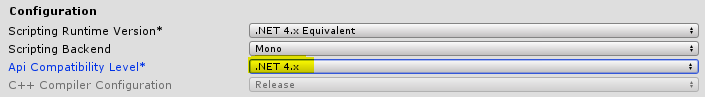

### Unity HDRP — vvvv/vl Bridge

## Setup/Unity
#### Git Extension For Unity Package Manager
Install [UpmGitExtension](https://github.com/mob-sakai/UpmGitExtension) to your
Unity project — it let's you manage Unity Packages from Unity Package Manager.

You can then install the package from the repository link.


#### Manual Installation
###### Installation
In your Unity projects `Packages/manifest.json` add the following line:

`"de.nsynk.unity.glue": "https://git.nsynk.de/nsynk/de.nsynk.unity.glue"`

If you need a **specific version** you can add a verison tag behind it e.g.:
`"de.nsynk.unity.glue": "https://git.nsynk.de/nsynk/de.nsynk.unity.glue#0.0.6"`

###### Updating
In case Unity is not updating after you changed the version in `manifest.json`, delete the `lock`
entry in `Packages/manifest.json` for glue:

```json
  "lock": {
    "de.nsynk.unity.glue": {
      "hash": "7fc29eb17199c411944ea7a71bebb7a2278ae5ae",
      "revision": "0.0.2"
    }
  }
```

##### Building Unity Executable
:warning: Make sure to select **.NET 4.x** in your Player Settings under **Other
Settings/Configuration**:



---

## Setup/vvvv
Make sure to clone [NSYNK-Arsenal](https://git.nsynk.de/nsynk/NSYNK-Arsenal)
into your vvvv **packs/** directory.
